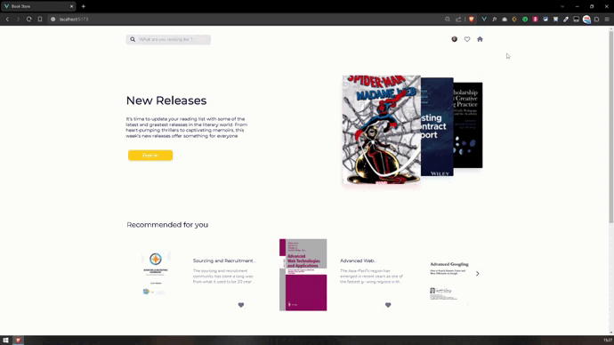

# BOOK STORE

📚 Find any book. The app is based on Google API, allows you to pick up a book to read and save it to your Google account shelf.



## Technical stack, technologies

- HTML, CSS
- JavaScript
- Vue3
- Vite
- ESLint
- Vue-router
- Tailwind
- Fontawesome
- Axios
- Pinia
- Swiper
- Vue3-google-login
- Vuejs-paginate-next

## Project Setup

```sh
npm install
```

### Compile and Hot-Reload for Development

```sh
npm run dev
```

### Compile and Minify for Production

```sh
npm run build
```

### Lint with [ESLint](https://eslint.org/)

```sh
npm run lint
```